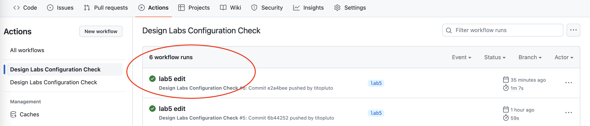
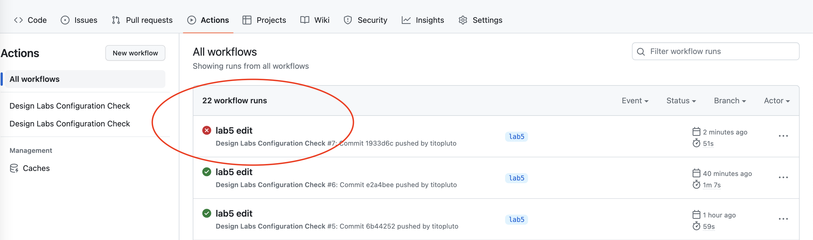
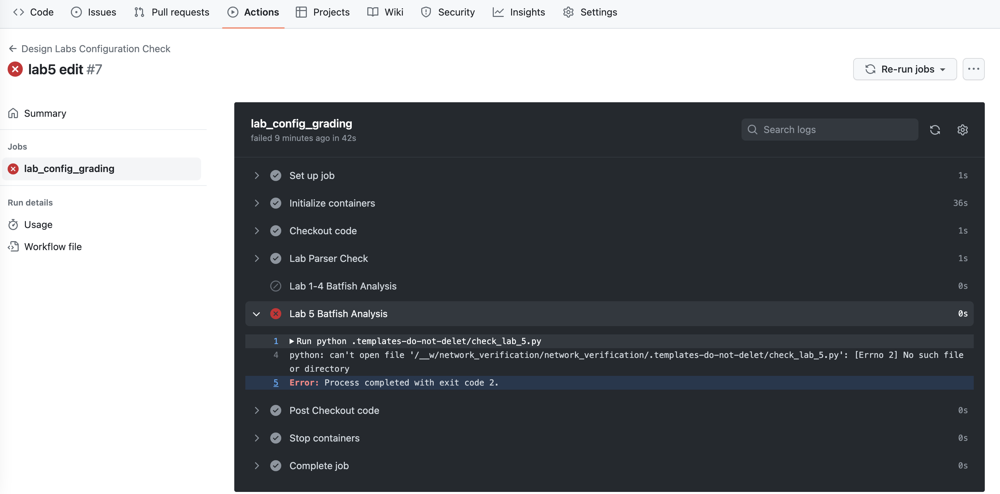
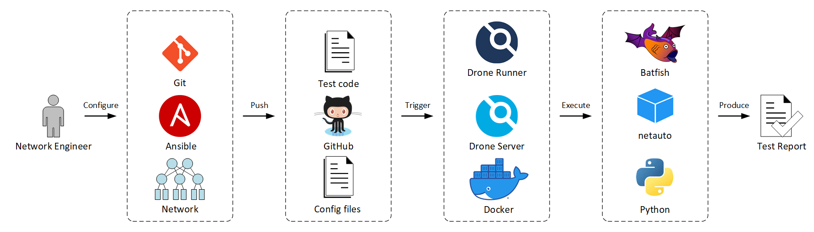

# Automated Network Verification

This repository provides an automated process to checking the correctness of network configuration files generated during lab sessions.

Modified from the original repository of: https://github.com/martimy/Network_Verification

This document consists of the following sections:

- Verification Tests: Provides information about the tests performed by the pipeline.
- Usage Instructions: Provides usage instructions to students (this applies only to a specific course. General audience can use this section as a guideline only.)
- Verification Components: Provides information about the tools used in the CI/CD pipeline
- Software Installation: Provides instructions on how to install the software tools used in the repository.
- Acknowledgments: Lists the references and inspirations for this work.

## Verification Tests

There are two categories of verification tests performed on the lab configuration:

### Parsing tests

Parsing tests are performed using simple parsing of configuration files to confirm the presence of specific lines of configuration. The tests are performed on all labs and they include:

- SNMP configuration check: Confirms the presence of SNMP community strings, location, and contact lines.
- SysLog configuration check: Confirms the presence of SysLog server line.
- Clock configuration check: Confirms the present of time zone settings.

The parsing test fail if any of these individual tests fail.


### Configuration tests

Batfish is a network configuration analysis tool that guarantees the correctness of a network's configuration file by building a model of the network's behavior based on device configurations.

Batfish is used to perform simple tests on lab configuration files. These tests differ depending on the lab assignment.

**Labs 1 to 4 tests:**

- Number of Routers: Check of there are five configuration files and each file represents a unique router (no duplicates)
- Valid Configuration: Ensures that Batfish is able to recognize the vendor's configuration files.   
- Clean Parsing: Checks if there are certain configuration lines that Batfish cannot understand or ignores.
- Host Properties: Tests if the router's name, the domain name and NTP servers are configured as expected.
- Undefined References: Tests if there are structures (such as ACL) that are used in the configuration but not defined.
- Shut Interfaces: Tests if all unused interfaces are shutdown.

Labs 1-4 configuring test fails if any of the above tests fail except the configuration and parsing tests. The test continues even if some configuration lines are not understood by Batfish.

**Lab 5 tests:**

Lab 5 checks include all previous checks and three more:

- Duplicate Router IDs: Checks there are no duplicate BGP router IDs.
- BGP Compatibility: Checks that there are no incompatible BGP sessions present in the configuration.
- BGP Unestablished: Checks if there BGP sessions that are compatible but not established.

Lab 5 configuration test fails if any of the above tests fail.


## Usage Instructions


### Pre-lab instructions for students

This Lab uses GitHub Classroom. if you have access to this repository then you have already accepted the classroom assignment link. if not contact your lab instructor to receive an invitation link

Instructors will also be able to view the results and advise students on how to fix any errors.

### Post-lab instructions for students:

Follow these instructions after completing all lab configuration steps:

##### Optional:
you can also enable a pre-push hook that will run unit tests before you push from local repository.
To enable the hook, run the following command from the root of the project:
```shell
ln -s ../../.pre-push.hook .git/hooks/pre-push
```

1. Clone this repository on your local machine and change directory into it.
    ```
   $ git clone <name-of this-assignnment-repository>
   $ cd <name-of this-assignnment-repository>
   ```

2. Create a branch named the current lab you are doing and checkout the branch. for example: if you're doing lab1 then create a new branch called lab1
   ```
   $ git checkout -b lab1
   ```
3. Copy network device configuration using Ansible:
   ```
   $ export ANSIBLE_HOST_KEY_CHECKING=False
   $ ansible-playbook -i playbooks/inventory.txt playbooks/play_backup.yml
   ```
   If the above process was successful (all routers report ok=1), then you will find a folder 'lab/configs' created in the repository. If the process failed, then it is likely that the SSH configuration on the network devices is not completed and you must follow the instructions in the lab assignment documents to configure SSH.
4. Commit the changes and push the branch:
   ```
   $ git add lab
   $ git status
    On branch lab1
    Changes to be committed:
      (use "git reset HEAD <file>..." to unstage)

            new file:   lab/configs/R11.cfg
            new file:   lab/configs/R12.cfg
            new file:   lab/configs/R21.cfg
            new file:   lab/configs/R22.cfg
            new file:   lab/configs/R23.cfg
   $ git commit -m "add config files for lab1"
   $ git push --set-upstream origin lab1
   ```
5. Check if your configuration files have passed the checks:
   - Go the "Actions" tab on the left tab click the workflow called: Design Labs Configuration Check
   - View the Workflow runs, the latest workflow rub will be the name of your last commit
   - Verify that you have a green checkmark next to your latest commit. You can click on the commit to find more details on the results.
   - 
   

6. If there are any errors, you will see a red checkmark next to your latest commit.

   
    
    You can click on the commit to find more details on the results.

    

    modify your configuration files and repeat the steps 3 to 4


## Verification Components

This configuration verification process applies some CI/CD principles to check device configuration against some common configuration errors. The pipeline includes the following components:



- [Ansible](https://www.ansible.com/) — Network automation tool (based on Python):  
  Ansible is used to automate the configuration of network devices as well at retrieve the configuration files in preparation for the configuration check.
- [Batfish](https://www.batfish.org/) — Network configuration analysis tool (based in Python):  
  Batfish performs vendor-independent verification of network configuration by answering several questions and comparing answers with expected results.   
- [Docker](https://www.docker.com/) — Platform for building, deploying, and managing containerized applications:  
  Docker runs several containers in the pipeline, including: Drone Server, Drone Runner, Batfish, and martimy/netauto.
- [GitHub Actions](https://docs.github.com/en/actions) — Continuous integration platform:  
  A Drone server manages the pipelines while one or more Drone runners poll the server for workloads to execute. The pipeline execution is triggered when a network configuration is pushed to the GitHub repository.
- [Git](https://git-scm.com/) — Revision control system:  
  Git tracks network configuration changes and pulls/pushes the configuration to a GitHub repository.
- [GitHub](https://github.com/) — Cloud-based Git repository:  
  Hosts all test scripts, Ansible scripts, and Drone configuration file. GitHub is also used to push network configuration files to trigger the checking pipeline.
- [martimy/netauto](https://hub.docker.com/r/martimy/netauto) — Docker image:  
  This is Python container that includes all modules needed to run the test scripts.
- [Python](https://www.python.org/) — Programming language for network applications:  
  All test software is written in Python, including scripts that run tests that are not available in Batfish.

## Acknowledgments

Template was extended from the original work of: https://github.com/martimy/Network_Verification
